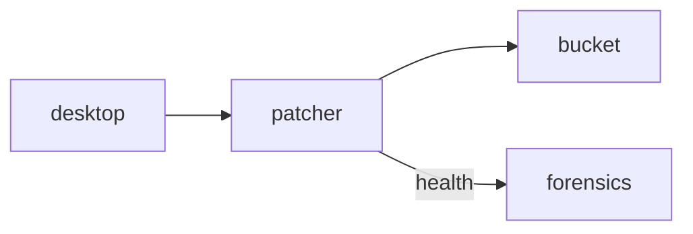

# Patcher

**Auto-Updater** — Lightweight daemon that patches the desktop client silently and verifies signatures.

Part of [ComputerPets](https://github.com/RicheyWorks/computerpets). Map: [computerpets-ecosystem](https://github.com/RicheyWorks/computerpets-ecosystem).

| | |
| --- | --- |
| Status | Design scaffold — contract frozen, implementation next |
| License | MIT |
| First pet | Still [Rui on the desktop](https://github.com/RicheyWorks/computerpets/blob/main/docs/START-HERE.md). This organ is optional. |

## The job

Friends should not re-clone GitHub to get a walk-cycle fix. Patcher is the missing .exe path the flagship README still warns is not in a store.

The flagship overlay already puts a living sticker on the real desktop (Rui first, 210 kinds). Patcher does not replace that. It is one organ.

## Who uses it

The desktop client. Friends should not re-clone GitHub for a walk-cycle fix.

## What it is not

Not SteamPipe itself. Steam can still own the bit later. Never patch while Rui is mid-walk.

## Architecture



## Stack

Go or Java daemon · delta patches · SteamPipe optional · code-signed Windows/macOS/Linux

GroupId / namespace: `com.enterprisepet.patcher`  
Default listen: `8742`

## Contract

### Data

`Channel(stable|beta) · Release(semver, sha256, sig) · Delta(from, to, size)`

### Surface

- GET /v1/latest?channel=stable — version + urls + signatures
- GET /v1/delta?from=&to= — patch blob
- POST /v1/health — daemon ping

### Failure doctrine

Bad signature → refuse, tray warning. Partial download → resume. Overlay running → apply on next quit, never mid-walk.

## First slice

Build this and stop. Do not boil the ocean.

**`GET /v1/latest?channel=stable` + signature check + apply-on-quit.**

You know it works when: Bad signature: refuse + tray warning. Partial download resumes. Overlay running: wait for quit.

## Environment

`RELEASE_BUCKET`, `SIGNING_CERT`

Never commit secrets. Never put Steam or chain keys in the overlay.

## Neighbors

- computerpets desktop
- computerpets-steamgate
- computerpets-forensics

## Layout

```
computerpets-patcher/
  README.md           this file
  LICENSE             MIT
  docs/CONTRACT.md    the same contract, frozen for implementers
  src/                implementation lands here
```

## Run (Windows)

PowerShell, from this folder, after the flagship helpers (Git, Node LTS 22+, JDK 21 as needed):

```powershell
go build -o patcher ./cmd/patcher  (Windows: patcher.exe as a user service)
```

You do not need this service to meet Rui. The [flagship start-here](https://github.com/RicheyWorks/computerpets/blob/main/docs/START-HERE.md) is still the first pet.

## Links

- Flagship: [RicheyWorks/computerpets](https://github.com/RicheyWorks/computerpets)
- This repo: [RicheyWorks/computerpets-patcher](https://github.com/RicheyWorks/computerpets-patcher)
- Map: [RicheyWorks/computerpets-ecosystem](https://github.com/RicheyWorks/computerpets-ecosystem)
- Contract file: [docs/CONTRACT.md](docs/CONTRACT.md)

## License

MIT. See [LICENSE](LICENSE).

---

*Two hundred ten living kinds. Keep them so a line does not go quiet.*
